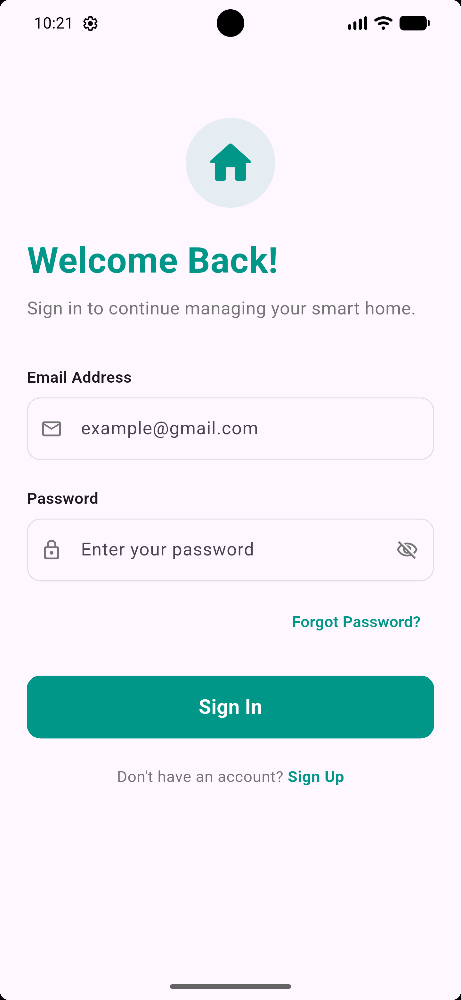
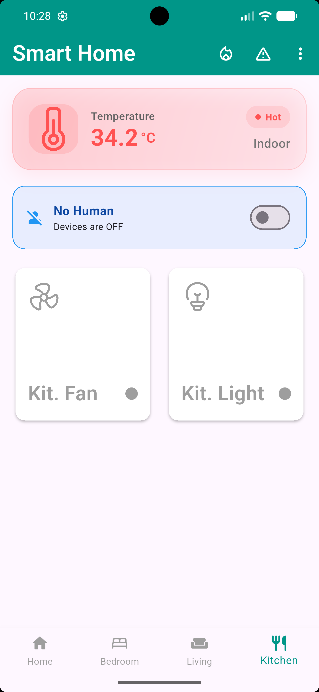
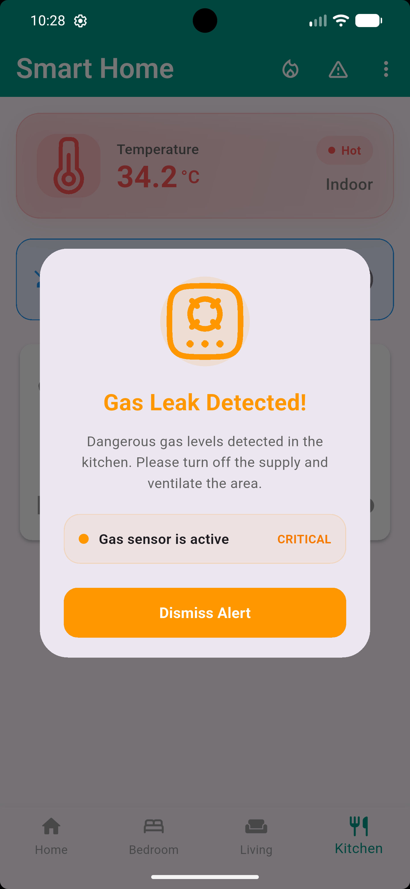
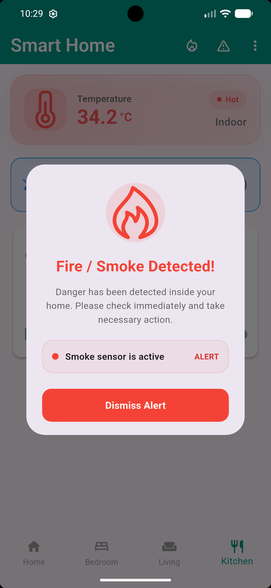

# ESP32 & Flutter Smart Home System

A comprehensive IoT-based smart home automation system featuring a Flutter mobile application and ESP32 hardware integration via Firebase Realtime Database.

## 🚀 Features

### Hardware (ESP32)
*   **Multi-Room Control:** Remote switching for Bedroom, Living Room, and Kitchen (Fans & Lights).
*   **Environmental Monitoring:** Real-time temperature and humidity tracking using the DHT11 sensor.
*   **Safety System:** Gas leakage detection using the MQ-5 sensor with a local buzzer alarm and remote database updates.
*   **Firebase Integration:** Synchronizes device states and sensor data in real-time.
*   **Active-High Relay Logic:** Specifically configured for standard relay modules.

### Software (Flutter App)
*   **User Authentication:** Secure Sign-in and Sign-up screens powered by Firebase Auth.
*   **Real-time Dashboard:** Monitor sensor readings and toggle home appliances from anywhere.
*   **Cross-Platform:** Built with Flutter for Android and iOS compatibility.

---

## 📸 Screenshots

### Mobile Application
<p align="center">
  
  
  
  
</p>

### Real-time Monitoring
<p align="center">
  
  
  
  
</p>

---

## 🛠 Hardware Components

| Component | Pin (ESP32) | Function |
| :--- | :--- | :--- |
| **DHT11** | GPIO 4 | Temp & Humidity Sensor |
| **MQ-5** | GPIO 39 (Analog) | Gas Leakage Sensor |
| **Buzzer** | GPIO 23 | Gas Alert Alarm |
| **Bedroom Fan** | GPIO 25 | Relay Control (Active High) |
| **Bedroom Light** | GPIO 26 | Relay Control |
| **Living Fan** | GPIO 18 | Relay Control |
| **Living Light** | GPIO 19 | Relay Control |
| **Kitchen Fan** | GPIO 21 | Relay Control |
| **Kitchen Light** | GPIO 22 | Relay Control |

---

## 💻 Software Setup & Run Instructions

### 1. Firebase Configuration
*   Create a Firebase project at [Firebase Console](https://console.firebase.google.com/).
*   Enable **Authentication** (Email/Password).
*   Enable **Realtime Database** and set rules to allow read/write.
*   Obtain your `API Key`, `Database URL`, and `User Credentials`.

### 2. ESP32 (Arduino Setup)
#### Required Libraries (Install via Arduino Library Manager):
*   **FirebaseClient** (by Mobizt)
*   **DHT sensor library** (by Adafruit)
*   **Adafruit Unified Sensor** (dependency for DHT)

#### Running the Arduino Project:
1.  Open `arduino_code/smart_home.cpp` in Arduino IDE or VS Code (with PlatformIO).
2.  If using Arduino IDE, you might need to rename the file to `smart_home.ino` or create a new sketch and paste the code.
3.  Update the following constants in the code:
    ```cpp
    #define WIFI_SSID       "Your_Wifi_Name"
    #define WIFI_PASSWORD   "Your_Wifi_Password"
    #define API_KEY         "Your_Firebase_API_Key"
    #define USER_EMAIL      "Your_Email"
    #define USER_PASSWORD   "Your_Password"
    #define DATABASE_URL    "Your_Database_URL"
    ```
4.  Connect your ESP32 to your computer.
5.  Select your board (e.g., **DOIT ESP32 DEVKIT V1**).
6.  Click **Upload**.

### 3. Flutter Application
#### Required Plugins:
*   `firebase_core`: For Firebase initialization.
*   `firebase_database`: For real-time data sync.
*   `firebase_auth`: For user management.
*   `hugeicons`: For UI icons.

#### Running the Flutter Project:
1.  Ensure you have Flutter installed.
2.  Navigate to the project root directory.
3.  Run `flutter pub get` to install dependencies.
4.  Configure Firebase for Flutter:
    *   Install Firebase CLI: `npm install -g firebase-tools`
    *   Log in: `firebase login`
    *   Install FlutterFire CLI: `dart pub global activate flutterfire_cli`
    *   Run configuration: `flutterfire configure` (This updates `lib/firebase_options.dart`).
5.  Connect your physical device or start an emulator.
6.  Run the app: `flutter run`.

---

## 📂 Project Structure

*   `arduino_code/`: Contains the ESP32 source code (`smart_home.cpp`).
*   `lib/`: Flutter application source code.
    *   `feature/screen/`: UI screens for each room and authentication.
    *   `feature/widget/`: Custom reusable widgets (Cards, Dialogs).
    *   `firebase_options.dart`: Auto-generated Firebase config.
*   `android/`: Android-specific build configuration.

## ⚠️ Safety Warning
This project involves high-voltage relay switching (if used with AC appliances). Ensure proper insulation and safety measures when wiring the relays. The MQ-5 sensor requires a warm-up period for accurate gas detection readings.
